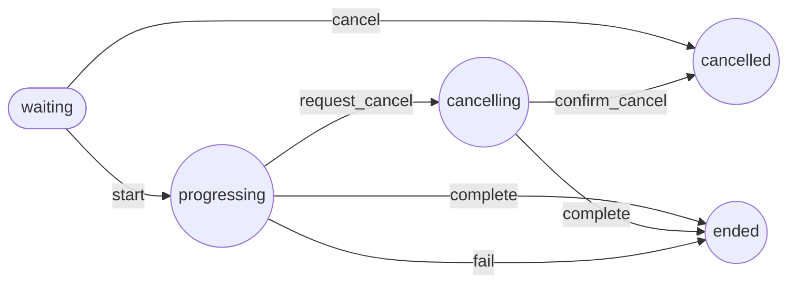

# Cycle de vie des jobs (job_lifecycle)

Diagramme officiel généré par php bin/console workflow:dump job_lifecycle --dump-format=mermaid.

```mermaid
graph LR
place0(["waiting"])
place1(("progressing"))
place2(("cancelling"))
place3(("cancelled"))
place4(("ended"))
place0-->|"start"|place1
place1-->|"request_cancel"|place2
place0-->|"cancel"|place3
place2-->|"confirm_cancel"|place3
place1-->|"complete"|place4
place2-->|"complete"|place4
place1-->|"fail"|place4
```
